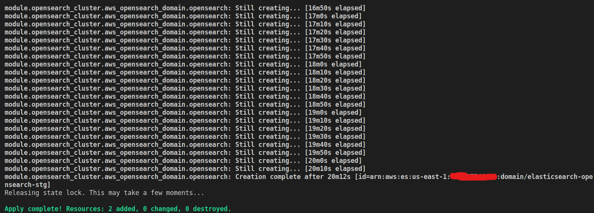
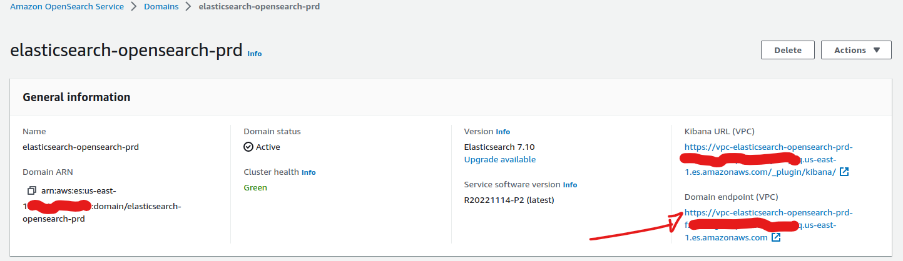
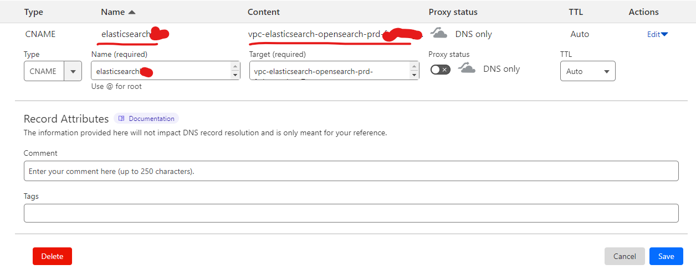
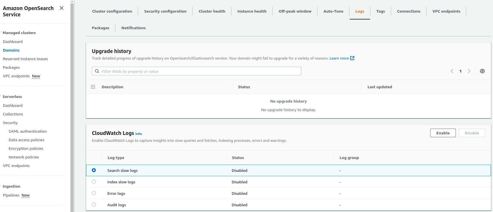

# Opensearch-ElasticSearch

## Sizing / Infos

#### Production

|Environment|Production                |
|--------|-----------------------------|
|Account   |XXXXXXXXXXXX                 |
|Service |Opensearch                   |
|Engine  |Elasticsearch 7.10           |
|Name of resource|elasticsearch-opensearch-prd |
|Url Access|https://elasticsearch.MYDOMAINNAME.com.br/_plugin/kibana/|
|Nodes   |3                            |
|Kind    |Master and Slave               |
|Family  |t3.small.search              |
|Disk   |20GB                         |
|SAML Account|SERVICEACCOUNTE-MAIL@MYDOMAINNAME.com.br|
|App name SAML|Elastic Search Prd      |

## Architecture Schema

Bellow is documentation regarding the AWS Opensearch service:
[Opensearch](https://docs.aws.amazon.com/opensearch-service/latest/developerguide/what-is.html)

## Installation and Automation

At the root of the **opensearch-elasticsearch** path of this repository, run the commands below to upload the environment automation via terraform:

```sh
terragrunt init
terragrunt plan
terragrunt apply
```


#### Configuration Custom URL Opensearch

When the service is created, it generates a URL called **Domain Endpoint** like this **https://vpc-elasticsearch-opensearch-prd-fzthtnngzhwpxxxxxxxxxxxxxx.us-east-1.es.amazonaws.com**



To customize a more friendly URL and access the Kibana console, the **custom_endpoint** variable was defined in the **vars.tf** file to place the desired URL with your domain and the **custom_endpoint_certificate_arn** variable to link the wildcard certificate ***.MYDOMAIN.com.br**.

After that, for it to work, you need to create a CNAME in Cloudflare pointing to the URL provided in the **Domain Endpoint**, just do as below:




#### Configuration SAML Google

To configure Kibana console authentication, you must use a Google user with admin in Workspaces.
To do this, there are 2 official documentation to be followed to integrate Google and the AWS service:

[SAML app Google Workspaces](https://support.google.com/a/answer/6087519?hl=pt)
This refers to creating an application within the Google account for integration.

[SAML no Opensearch](https://docs.aws.amazon.com/opensearch-service/latest/developerguide/saml.html)
This refers to using the configurations previously generated within the AWS Opensearch service.

## Access

**Console PRD**
URL de acesso: https://elasticsearch.MYDOMAIN.com.br/_plugin/kibana/

## High Availability

The production environment was created using 3 nodes, so there is greater availability for the service and when the blue-green process is started in some configuration, the service is not down for the entire duration of the Cluster maintenance.

## Backup

To perform a backup procedure, it is necessary to follow some of the documentation in the following link:

[Snapshot documentation](https://docs.aws.amazon.com/pt_br/opensearch-service/latest/developerguide/managedomains-snapshots.html)

## Disaster recovery

In case of need for recovery, it will be necessary to run the automation created via terraform already documented previously
[Automation and Installation](#installation-and-automation)

## Troubleshooting

To troubleshoot the Opensearch service, it is necessary to use the Logs available in the service.



If more in-depth monitoring is necessary to help with troubleshooting, the official documentation provides the path to follow:
[Monitoramento Opensearch](https://docs.aws.amazon.com/opensearch-service/latest/developerguide/monitoring.html)

## References

[Opensearch](https://docs.aws.amazon.com/opensearch-service/latest/developerguide/what-is.html)

[SAML app Google Workspaces](https://support.google.com/a/answer/6087519?hl=pt)

[SAML with Opensearch](https://docs.aws.amazon.com/opensearch-service/latest/developerguide/saml.html)

[Snapshot documentation](https://docs.aws.amazon.com/pt_br/opensearch-service/latest/developerguide/managedomains-snapshots.html)

[Monitoring Opensearch](https://docs.aws.amazon.com/opensearch-service/latest/developerguide/monitoring.html)
